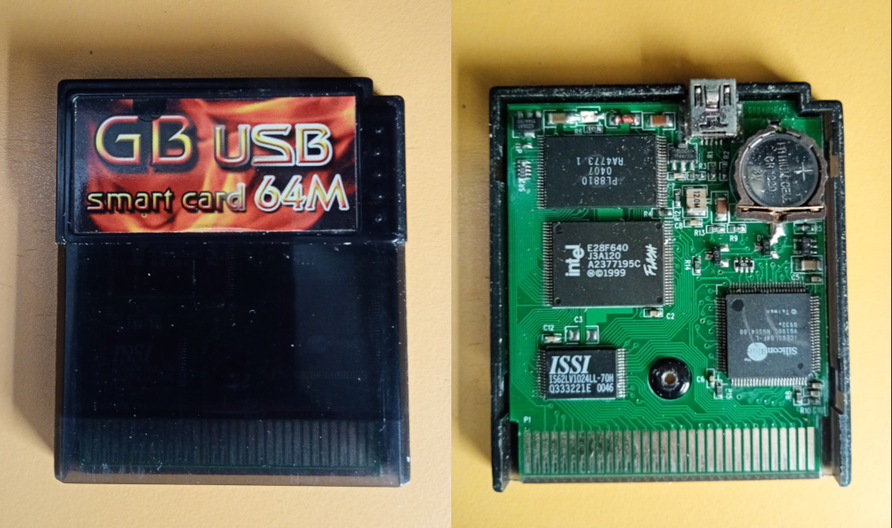

MULTI MENU
----------

This is a python script to create multi rom menus for game boy "USB EMS card" (32 or 64M). (These cartridges included a win32 software which no longer works on modern systems).

I used this repository to create a python port: https://github.com/Raphael-Boichot/GB-SMART-multiboot-rom-manager/tree/main.

Just create a folder named "rom" with your roms in it and run "create.py".

You should not mix gb and gbc roms in the same menu rom.

Once you have your multi-rom file, flash it to the EMS cart using EMS quart (which works on windows, linux, mac): https://github.com/rbino/ems-qart

You shoud be able to use any other menu, but I used mottzilla's one, because it includes an sram manager which can store savegames for several roms at the same time.
